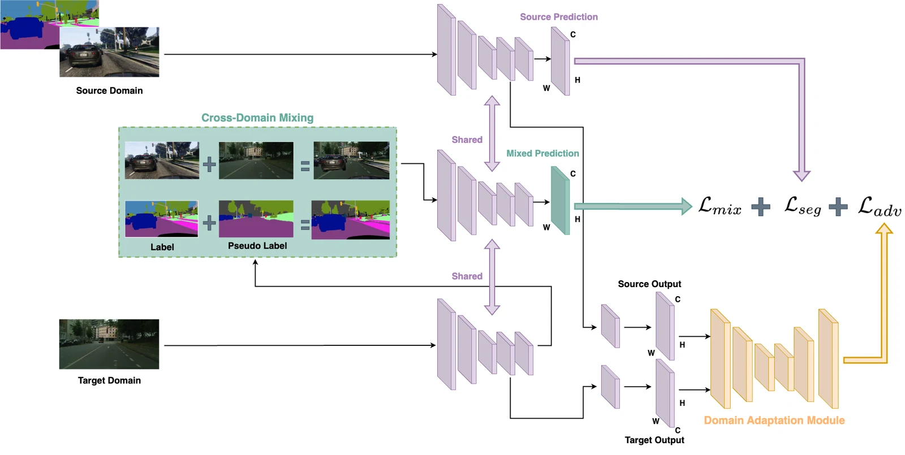

**Authors** — Alice Banaudi, Carla Finocchiaro, Alessandra Marchese, Leonard Vincent Ramil

**Course** — Machine Learning and Deep Learning course project, 2025

**Paper** — [ADACS.pdf](adacs.pdf) · **Code** — [github.com/LeoRamill/ADACS](https://github.com/LeoRamill/ADACS)

## Abstract

Unsupervised domain adaptation in semantic segmentation presents significant challenges, especially
when generalizing a segmentation model trained on labeled images from a synthetic (source) domain to
unlabeled images in a real (target) domain characterized by distinct visual distributions. We
establish performance baselines by training two representative models — a high-accuracy architecture
(DeepLabv2) and a real-time architecture (BiSeNet) — on the Cityscapes dataset, while also exploring
the impact of different loss functions. Building upon the Domain Adaptation via Cross-domain Mixing
for Semantic Segmentation (DACS) approach, which generates hybrid training samples by combining
segments of source images with pseudo-labeled regions from target images, we propose an enhanced
methodology that incorporates adversarial attack modules to strengthen the robustness and accuracy of
pseudo-labels: ADACS. Experimental validation on the GTAV → Cityscapes benchmark demonstrates
significant improvements in mean Intersection-over-Union (mIoU) compared to the original DACS and
other state-of-the-art methods, approaching the performance of supervised models trained directly on
the target domain, without requiring additional real-world annotations.

## The problem

Semantic segmentation needs pixel-level annotations, and producing them by hand is slow and
expensive. Synthetic data sidesteps that — a game engine labels its own frames for free — but a model
trained on synthetic images and run on real ones falls apart: the two domains do not look alike, and
the network has no way to know which differences matter. On GTAV → Cityscapes, BiSeNet with a
ResNet-18 backbone drops to **14.19% mIoU** when it simply crosses the domain gap untreated.

## Method

ADACS trains two adaptation mechanisms at once, on the same shared backbone.

**Cross-domain mixed sampling** comes from DACS. The network first predicts pseudo-labels for the
unlabeled target images. A binary mask is built by picking half the semantic classes present in a
source label at random, and that one mask cuts both the images and the labels: source pixels of the
chosen classes are pasted onto the target image, and the same regions of the source ground truth are
pasted onto the target pseudo-label. The result is not photorealistic, but image and label stay
aligned, and the mixed sample carries the structure of the source with the appearance of the target.

**Adversarial domain adaptation** adds a discriminator that looks at a prediction and decides which
domain it came from. Training the segmentation network to fool it pushes source and target
predictions towards the same distribution.

The full objective is the sum of the three:

`L_ADACS = L_seg(Xs, Ys) + λ_adv · L_adv(Xt) + λ_dacs · L_mix`

The two mechanisms fix different things, which is the reason for combining them. Mixing gives the
network supervision on target-looking pixels but inherits whatever its own pseudo-labels get wrong;
the adversarial term aligns the domains without ever needing a label, which makes those pseudo-labels
better in the first place.

### Lightweight discriminator

The discriminator is five 4×4 convolutions, stride 2, with depths 64, 128, 256, 512, 1, each but the
last followed by a leaky ReLU (α = 0.2), then an upsampling layer back to full resolution. We
replaced its standard convolutions with **depthwise-separable** ones — a per-channel filter followed
by a 1×1 that mixes channels — which takes the cost from `O(K²·C_in·C_out)` to
`O(K²·C_in + C_in·C_out)`. It was not only cheaper: the DSC discriminator converged to a steadier
27.36% mIoU against 26.24% for the fully convolutional one, which wandered more from run to run.

## Results

GTAV → Cityscapes, BiSeNet, 19 classes, mIoU on the Cityscapes validation set:

| Method | ResNet-18 | ResNet-101 |
|---|---|---|
| Domain shift, no adaptation | 14.19 | — |
| Augmentation only | 23.80 | 26.38 |
| Adversarial DA (DSC discriminator) | 27.36 | 33.21 |
| DACS | 23.17 | 27.57 |
| **ADACS (DSC)** | **29.76** | **37.01** |

With the ResNet-101 backbone ADACS reaches **37.01% mIoU** — 3.8 points over adversarial adaptation
alone and 9.4 over DACS alone, so the two mechanisms together beat either on its own by a clear
margin rather than averaging out. The gains concentrate on the classes that carry the scene: road
87.51, car 79.44, vegetation 80.93, building 78.60. Qualitatively, ADACS stops confusing sidewalk
with road, which DACS still does.

The supervised baselines on Cityscapes, for reference: DeepLabV2 with ResNet-101 reaches 54.35% mIoU
at 14.3 FPS, while BiSeNet with the same backbone matches it at 54.30% and 39.1 FPS — and BiSeNet
with ResNet-18 runs at 68.1 FPS on 12.58M parameters, which is why it is the backbone the adaptation
experiments build on.

## What does not work yet

The small classes stay unsolved. Bicycle is predicted at 0.0 in every configuration we ran, and
motorcycle and train are close to it. These are the classes with the fewest pixels in the dataset,
and neither mixing nor adversarial alignment gives the network a reason to care about them.
Contrastive learning on the minority classes is the direction we would take next, along with a proper
hyperparameter search over the optimizer and the learning rate, which we set from the original papers
rather than tuning ourselves.

## Setup

Trained with SGD, Nesterov momentum 0.9, weight decay 10⁻⁴, initial learning rate 2.5×10⁻⁴ on a
polynomial schedule with power 0.9; the discriminators with Adam at 10⁻⁴ (β₁ = 0.9, β₂ = 0.99) on the
same schedule. `λ_adv` = 0.001, `λ_dacs` = 0.1. The segmentation loss is cross-entropy plus Dice,
which trained more stably than cross-entropy alone. Datasets: GTAV (24,000+ annotated frames from
Grand Theft Auto V) as source, Cityscapes (5,000 finely annotated images from German cities) as
target, sharing the same 19-class label set.
