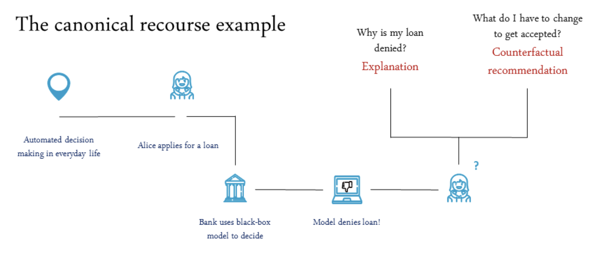

**Where** — HERCOLE Lab, Sapienza University of Rome · May – October 2024

**Supervisor** — Prof. Gabriele Tolomei

**Context** — PNRR project, in collaboration with Intesa Sanpaolo

**Code** — [github.com/hercolelab/CARLA (branch_1)](https://github.com/hercolelab/CARLA/tree/branch_1) · built on [CARLA](https://arxiv.org/abs/2108.00783)

## The problem

The picture above is the canonical example of algorithmic recourse. Alice applies for a loan, a
black-box model denies it, and she is left holding two different questions. *Why was I denied?* asks
for an **explanation**. *What do I have to change to be accepted?* asks for a **counterfactual
recommendation** — the nearest version of her file that the model would have said yes to. The second
question is the harder and the more useful one: it is the one that gives her something to do.

[CARLA](https://arxiv.org/abs/2108.00783) — Counterfactual And Recourse Library — is the standard
benchmark for that second question. It ships four datasets (Adult, COMPAS, Give Me Some Credit,
HELOC), a catalogue of black-box models (neural network, linear, random forest, XGBoost) and about
fourteen recourse methods (Wachter, DiCE, FACE, Growing Spheres, REVISE, CCHVAE, CLUE, CRUDS,
Actionable Recourse, CEM, FeatureTweak, FOCUS, causal recourse, ROAR), all behind one interface, so
that two methods can be compared without reimplementing either.

CARLA assumes the world is a table: one row per person, and a counterfactual is that row with some
numbers moved. Financial crime is not a table. A suspicious account is suspicious **because of the
company it keeps** — who it pays, who pays it, how the money loops back. The model that flags it is
a graph neural network, and its decision depends as much on the account's neighbourhood as on the
account itself. None of CARLA's fourteen methods can say anything about such a model, because none
of them can perturb a graph.

## What this adds

This fork takes CARLA from tables to graphs, keeping the library's own interfaces so that a graph
model and a graph recourse method drop into the same benchmark loop as a tabular one.

**A transaction graph.** `AMLtoGraph` turns a raw anti-money-laundering transaction log into the
graph the problem actually is. Accounts become nodes, carrying per-currency aggregates of what they
paid and what they received; transactions become edges, carrying amount, currency, payment format
and a normalised timestamp; the laundering flag propagates from transactions to the accounts
involved. `PlanetoidGraph` does the same job for the academic citation benchmarks (Cora, CiteSeer,
PubMed), which gives a sanity check on data everyone already knows.

**Graph models in the model catalogue.** GCN, GAT and GIN, each in two variants: one taking a dense
adjacency matrix, one taking a sparse COO edge index with edge attributes — the second is what lets
a model read the *transactions* and not only the accounts. They train with neighbour sampling, so a
graph too large to hold in memory still fits, and the architecture search runs as Bayesian sweeps
maximising F1. The model API grows `predict_proba_gnn` and `predict_proba_gnn_coo` beside CARLA's
existing `predict_proba`, which is the hinge the whole thing turns on: a recourse method can now
query a graph model exactly the way the old methods query a tabular one.

**Counterfactual methods that perturb graphs.** Two families.
[CF-GNNExplainer](https://arxiv.org/abs/2102.03322) is adapted to all three architectures (CFGNN,
CFGAT, CFGIN): it learns a binary mask over the edges of the node's neighbourhood and looks for the
smallest set of edges to remove that flips the prediction — *this account would not have been
flagged if these three transfers had not happened.* Beside it, a **node perturber** and an **edge
perturber** ask the complementary question. Instead of cutting the graph they learn a perturbation
of the features — on node attributes, or on edge attributes — optimising a loss that is a
cross-entropy towards the opposite class plus the distance from the original features, so the answer
flips the decision while staying as close to the real account as possible. That is the difference
between *"this would not have been flagged without these transfers"* and *"this would not have been
flagged if these amounts had looked like this"* — the second is the one a compliance analyst can act
on.

## How it is measured

Three metrics, all averaged over repeated random samples of the data with their standard deviations,
which is what makes two methods comparable rather than two anecdotes:

- **Validity** — the fraction of factuals for which a counterfactual was actually found. A method
  that explains nothing is not a good method.
- **Sparsity** — how much of the graph had to change. Few edges, small feature moves.
- **Fidelity** — whether the explanation still agrees with the original model, rather than with a
  simplified copy of it.

Working across the three architectures and the two families of perturbation, the graph-based
extensions improved validity and fidelity by roughly **20%** over the baseline this started from.

## My contribution

I joined HERCOLE Lab at Sapienza for this, under Prof. Gabriele Tolomei, inside a PNRR project in
collaboration with Intesa Sanpaolo. My work was the graph half of the library: bringing the GNN, GAT
and GIN models into CARLA's model catalogue together with the graph-model prediction API, extending
the counterfactual methods from a single architecture to all three, and building the node and edge
perturbers and the validity/sparsity/fidelity evaluation they are scored with. The application that
drove all of it was anomaly detection on financial transactions — the case where "why" is not enough
and someone has to be told what would have had to be different.
