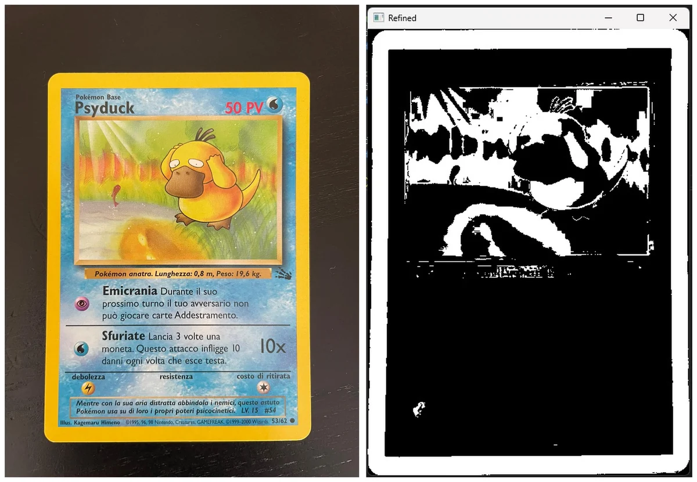
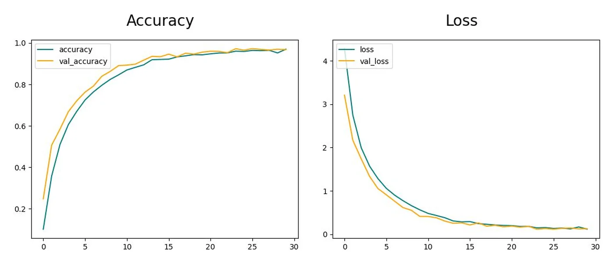

**Authors** — Christian Bianchi, Nicola Mastrorilli, Leonard Vincent Ramil, Siria Sannino

**Course** — AI Lab: Computer Vision and NLP, Sapienza University of Rome, 2022/2023

**Paper** — [KYC.pdf](kyc.pdf) · **Code** — [github.com/u-siri-ous/KYC](https://github.com/u-siri-ous/KYC) (AGPL-3.0)

## What it does

A collector holding a first-generation Pokémon card wants to know two things: which card is this, and what condition is it in. The second question is the one that sets the price, and it is the one a newcomer cannot answer — telling a Near Mint from an Excellent Mint by eye takes practice most people do not have.

KYC answers both from a single photograph. It grades the card against the **Beckett Grading Services** scale with OpenCV, identifies the Pokémon with a convolutional network trained on 151 classes, and puts the two together in a desktop window that reads like a graded slab: marks on the left, card data on the right.

The project is three parts — a grader, a classifier and a GUI — brought together in one `main`.

## Grading with OpenCV

Beckett scores a card on four factors, each from 1 to 10 with half-points: **centering, corners, edges and surface**. The first three are geometry, and geometry is what a photograph gives you.

The card is found in the picture through its border. Working in HSV rather than RGB, yellow is a range of hue and saturation rather than a combination of three channels that shift with the light:

```python
lower_yellow = np.array([20, 100, 100], dtype=np.uint8)
upper_yellow = np.array([30, 255, 255], dtype=np.uint8)

# White where the pixel falls in the yellow range, black everywhere else
mask = cv.inRange(hsv_image, lower_yellow, upper_yellow)
```

That mask does double duty: it locates the card so it can be cropped out of the background, and once binarised it is what the three geometric factors are measured on — the proportion of white pixels in each region gives centering, corner wear and edge chipping.



**Surface is the one that cannot be done this way**, and the paper says so rather than pretending otherwise: surface flaws — gloss, fine scratches, print spots — are mostly invisible in a photograph. It is averaged from the other three instead, which is an approximation and is labelled as one.

The grader and the classifier also cover for each other. A card with a corner torn away grades badly but is still identifiable, so the information is shown even when the grade is poor.

## Classifying the Pokémon

The dataset is [7,000 hand-cropped Pokémon images from Kaggle](https://www.kaggle.com/datasets/lantian773030/pokemonclassification), adapted because some first-generation Pokémon were missing — roughly 25 to 50 images per Pokémon, centred and correctly labelled. Small, in other words, which is what the rest of the design is answering.

Two splits were tried: sampling 15 images per class into validation, and a straight 80/20. Data augmentation — rescaling, shear, horizontal flip, zoom — stretches what there is.

Two networks were trained, both ending in a 151-way softmax:

- **Model 1** — two convolutional layers, 64 filters at 5×5 and 128 at 3×3, each followed by 2×2 max pooling, then flatten and softmax. Input 64×64×3, ReLU in the hidden layers, Adam, categorical cross-entropy. 30 epochs, batch 32, learning rate 0.001.
- **Model 2** — the same with a third convolutional layer duplicating the second, and a 128×128×3 input. 20 epochs, otherwise identical.

Training stops early: if an epoch's loss comes out above the previous one, training halts and the model is written to its `.h5`. With a few dozen images per class that is the guard that matters.

## Results



| Model | Input | Train accuracy | Train loss | Val accuracy | Val loss |
|---|---|---|---|---|---|
| **1** — two conv layers | 64×64 | 96.9% | 0.11 | **96.7%** | 0.12 |
| 2 — three conv layers | 128×128 | 94.0% | 0.21 | 94.0% | 0.22 |

The smaller network wins, and by a clear margin on a 151-class problem. The bigger input and the extra layer buy nothing here: with 25 to 50 images per class there is not enough data to fit the extra capacity, and the shallower model at a quarter of the input resolution generalises better. Validation tracks training closely in both — the early stopping is doing its job — so the gap is capacity against data, not overfitting.

## The window

The GUI is Tkinter and Pillow. The user picks an expansion — Base, Fossil or Jungle — and is then shown the photographed card beside its Beckett marks and everything the classifier recovered: name, set, rarity, HP, type, attacks with their costs and effects, weakness, resistance, retreat cost. The palette is taken from the Pokémon's type, so a Water card comes up blue.

## Where it would go next

Two directions, both about reach rather than accuracy: extending the same structure to other trading card games — Magic: The Gathering, Yu-Gi-Oh — and moving it to a phone, which is where someone actually holds a card they want to know about.
