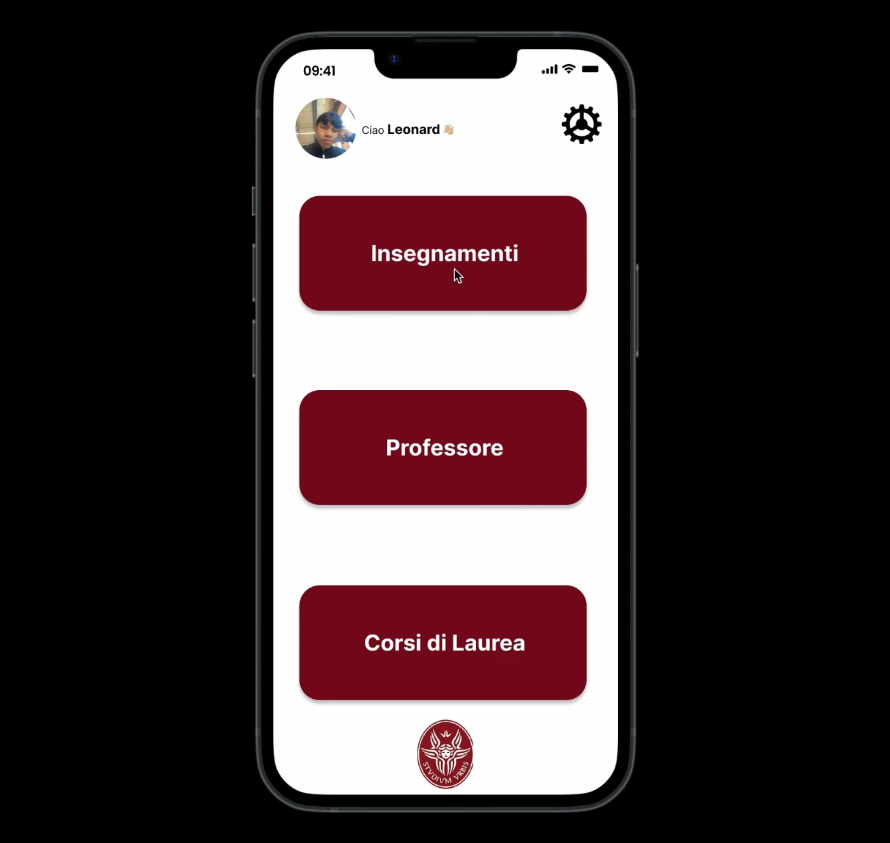
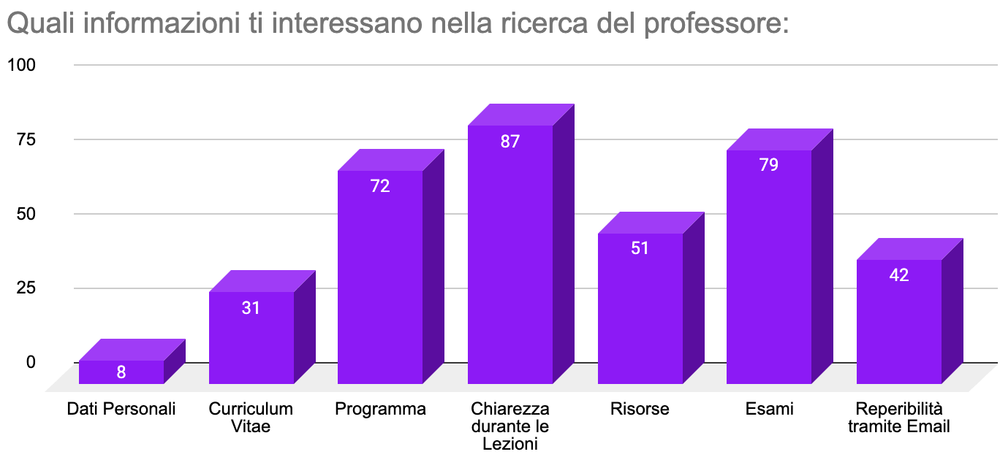
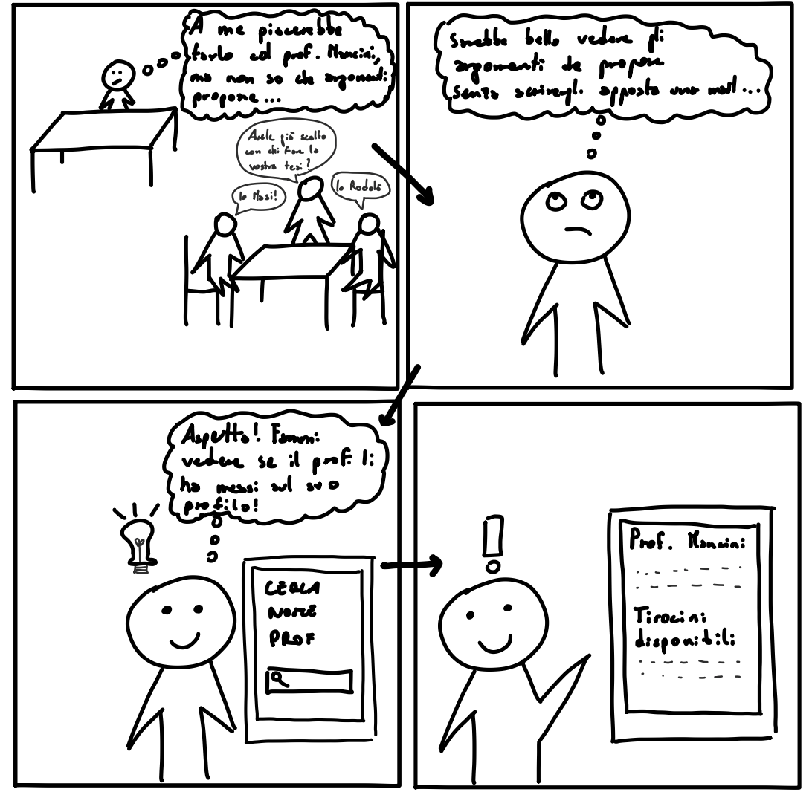

**Course** — Human-Computer Interaction, Sapienza University of Rome · 2023/2024

**Team** — *Intrusi di ACSAI*: Veronica Di Gennaro, Annafabia Gai, Christian Gennarelli, Daniel Y.
Guarnizo Orjuela, Leonard Vincent Ramil

**Brief** — *Help Sapienza students learn more about university courses and internal internships,
with particular attention to students' opinions about professors.*

**Code and material** — [github.com/LeoRamill/Human-Computer-Interaction-Project](https://github.com/LeoRamill/Human-Computer-Interaction-Project)

## Abstract

Choosing a university course means choosing a professor, and students have almost no way of finding
out who that professor is before they commit. This project treats that gap as a design problem
rather than an engineering one, and runs the full Human-Centred Design cycle against it. Semi-
structured interviews conducted across the university, followed by a questionnaire answered by about
a hundred students from eleven faculties, establish both halves of the problem: the professor is a
first-order criterion in choosing a course and in choosing an internship, and the information needed
to judge one is not anywhere a student can reach it — the dominant source is word of mouth. The
responses also order what students actually want to know (clarity in lectures, exam format and
syllabus, far above the academic CV), and that ordering becomes the feature list. Each need is then
carried through a storyboard, two rounds of paper prototyping and two of digital prototyping in
Figma, with user testing on every round and expert review on three, converging on an application
built around three entry points — teaching, professors and degree courses — validated end to end on
three tasks: finding notes other students posted on a specific topic, reading students' opinions of
a professor, and consulting the internships that professor still has available.

## Not a coding project

This one is deliberately not about building the thing. It is about earning the right to build it:
the whole Human-Centred Design cycle — needfinding, analysis, design, iteration and prototyping —
where every screen has to be justified by something a real student said, and every prototype is
thrown at users and at an expert before it is allowed to become the next prototype.

## Needfinding: asking before designing

Two instruments. **Semi-structured interviews**, conducted inside the university itself and across
departments, ages and years, following Robson and McCartan's five-stage structure — introduction,
warm-up, main session with the probing questions last, cool-down, close — so that each interview is
comparable to the others rather than a conversation that went wherever it went. Questions were kept
deliberately generic on three themes: **study plan**, **opinions about professors**, **internships**,
so as not to hand the student our own hypothesis and get it back.

Then a **questionnaire**, answered by about a hundred students — two thirds of them on a bachelor's
course, spread across eleven faculties, the largest single group (29%) from information engineering,
computer science and statistics, and the next two from psychology and from political science and
communication. The numbers are what turned an intuition into a brief.

The findings that shaped the product:

- **The professor is a selection criterion, not a detail.** Asked how much the professor weighs in
  choosing a course, on a 1–5 scale, 34 answered 4 and 12 answered 5 out of 85. Asked how much they
  care about other students' opinions of professors, 37 answered 4 and 19 answered 5 out of 103.
- **And there is nowhere to find that out.** Among students who had chosen an internal internship,
  the information available about it scored 1, 2 or 3 for 31 out of 42. The source most of them fell
  back on was word of mouth — the opinion of colleagues who had already worked with that professor,
  13 against 9 who found something on the professor's own page and 2 who found it on Infostud.
- **What they want is teaching, not biography.** Clarity in lectures, exam format and syllabus come
  far above the academic CV, and personal details come last. That ordering is the feature list.
- **Shared notes are wanted almost unanimously.** On how useful it would be to have material shared
  by colleagues, 42 answered 4 and 39 answered 5 out of 103, and not one answered 1.
- **The paperwork is its own problem.** What is unclear about filling in the study plan: whether it
  can still be modified (47), the deadlines (34), where it is even filled in (26). About the
  internship: the hours to be done (36) and when it starts and ends (36).

## From needs to screens

Each need became a **storyboard** first — a hand-drawn strip of a student hitting the problem, using
the app, and getting out of it — because a storyboard makes you write the *situation* before the
interface, and a screen nobody can draw a situation for is a screen nobody needs.

Then two rounds of **paper prototyping** and two of **digital prototyping** in Figma. Every round was
put in front of users, who ran the tasks while we watched, and three of the four also went through an
**expert review**. The notes from each of those sessions are in the repository, and they are the
reason the second prototype differs from the first.

## The three tasks it was tested on

The final prototype was validated on three end-to-end scenarios, each written as a task the tester
had to complete without help:

1. **Shared notes.** *You are in the first lecture of "Basi di Dati" and you did not follow the part
   on "Che cosa sono i dati?"* — search the course, find the topic, and open the notes other students
   posted on it, choosing the best rated ones regardless of date.
2. **Getting to know the professor.** *You are starting the second year of ACSAI and want to know
   more about your new professor* — search them, read the full opinions of other students, and find
   the one left by a specific colleague from an earlier year.
3. **The internship.** *You want to start an internship with that professor* — reach their page and
   consult the thesis and internship topics still available.

## What I took from it

That the hard part of a product is not the interface, it is knowing what it is for — and that the
only way to know is to go and ask, then keep checking that what you drew still answers what you
heard. Every round of testing killed something we were fond of, and the prototype was better for it
each time.
