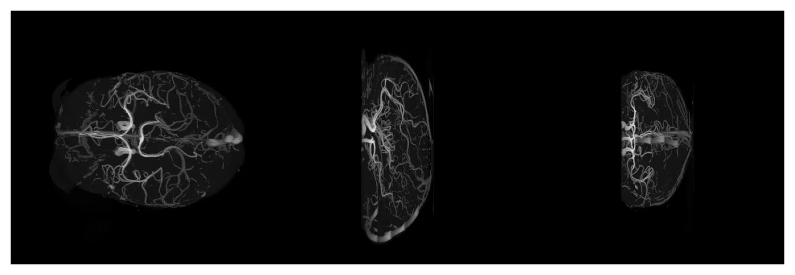
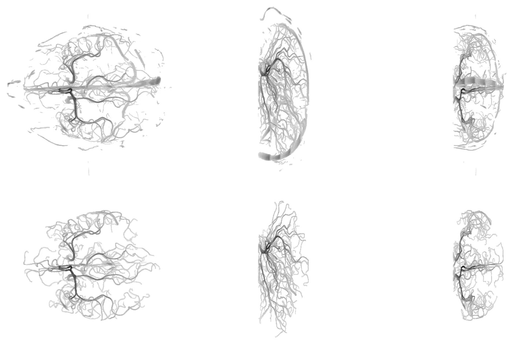
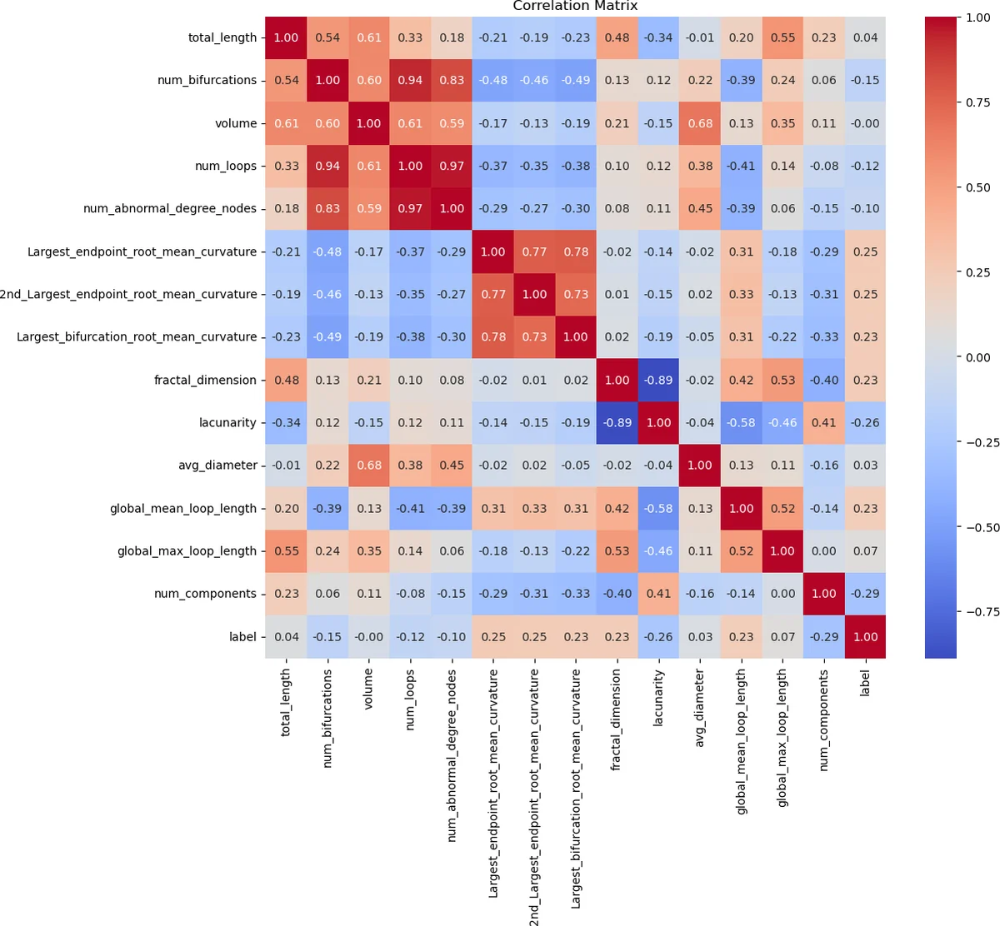
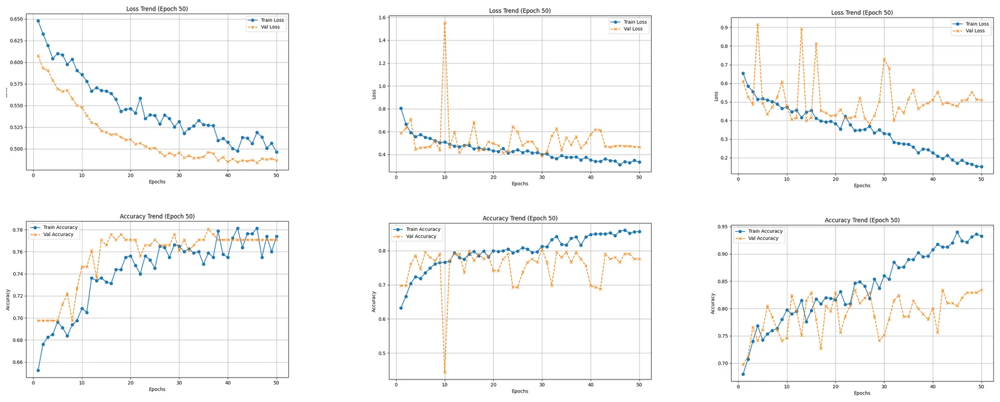
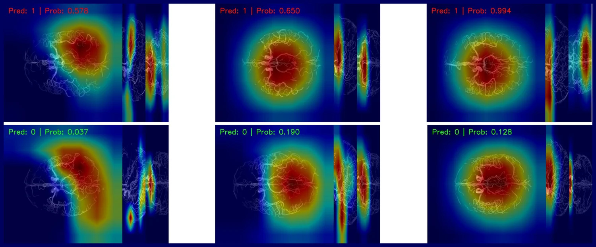
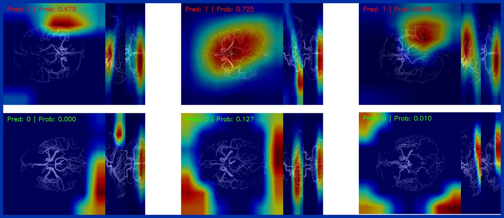

**Author** — Leonard Vincent Ramil

**Course** — Semester project, M.Sc. in Computer Science (Data Science track), EURECOM, 2025/2026

**Slides** — [the presentation](vesselverse-quality-control.pptx) · **Code** — [github.com/LeoRamill/VesselVerse-QualityControl](https://github.com/LeoRamill/VesselVerse-QualityControl)

## Abstract

VesselVerse collects annotations of cerebral vessels from automatic models, semi-automatic tools and
manual correction, and they are not equally trustworthy. Deciding which segmentations need a human to
look again is a job that does not scale to a person, so this project frames it as a binary decision
taken from the segmentation alone, with no reference to compare against. Each 3D volume is reduced to
three maximum intensity projections — axial, sagittal and coronal — which keeps the vessel tree
legible while making the problem tractable on a small dataset, and is described in parallel by a
vector of nineteen graph metrics of the same tree. Three models are compared over fifty epochs and
three optimizers: an MLP on the metrics alone, a multi-branch CNN on the projections alone, and a
multimodal network that concatenates a ResNet representation of each projection with the metric
branch. The tabular baseline is stable and stuck at about 79%; the multimodal model reaches about 83%
with Adam, but the training curves matter more than the peak — SGD underfits, RMSprop is violently
unstable, and Adam's best figure comes with training accuracy past 94% and validation loss turning
upward, which is overfitting rather than superiority. GradCAM over each projection branch is what
makes that reading concrete: when the model is right the evidence sits on the vasculature, and when
it is wrong the heat sits in the corners and along the edges of an otherwise empty frame, in one case
at maximum confidence. The conclusion the project keeps is that 83% validation accuracy from a model
that sometimes attends to empty space is not 83% of the job done, and that the explanation is what
tells you the metric is soft.

## The question

[VesselVerse](https://link.springer.com/chapter/10.1007/978-3-032-04947-6_62) is a dataset and collaborative framework for annotating cerebral vessels. Annotations arrive from several sources — automatic segmentation models, manual corrections, semi-automatic tools — and they are not equally good. Someone has to decide which ones can be trusted and which need a human to look again, and at the scale a dataset like this grows to, that someone cannot be a person.

So: **given a segmentation, predict whether it is good enough**. A binary decision, from the segmentation alone, with no reference to compare against.

## Seeing a 3D vessel tree in 2D

A segmentation is a 3D volume. A convolutional network could read it as one, but that is expensive and the dataset is small. Instead each volume is flattened into three **maximum intensity projections** — axial, sagittal and coronal, each pixel taking the brightest voxel along its line of sight. Three ordinary images, one per anatomical plane, from which a vessel tree is still legible.

## Labelling

The two ends of the scale were fixed with the same subject annotated two ways — automatically by SPOCKMIP, and by hand.

The difference is the kind of thing the classifier has to learn to see, and the project wrote it down as explicit criteria rather than leaving it to taste. A segmentation is marked bad for: **abnormal ramifications**, **noise** at the edges of the volume, **fragmented** vessels where a continuous one should be, and **distal cortical branches** — pial vessels resolved in a projection where they should not be, which is a sign the mask has picked up more than the arteries.

## Two ways to describe a segmentation

The interesting part of the project is that a segmentation gets described twice, in two languages, and the model is given both.

**As pictures**, through the three projections above.

**As numbers**, through [VESSEL-METRICS](https://github.com/i-vesseg/VESSEL-METRICS), which builds a graph representation of the vessel tree and measures it in four families:

- **Morphometric** — the extent and structural integrity of the network: total vessel length, volume, bifurcation count.
- **Topological** — the branching architecture and how it connects: number of loops, loop lengths, connected components, abnormal-degree nodes.
- **Fractal** — self-similarity and spatial texture: fractal dimension, lacunarity.
- **Geometric** — local shape irregularity along continuous curves: mean curvature and mean squared curvature, i.e. tortuosity.

That last family is the one a projection cannot give you: curvature is a property of a 3D curve, and flattening the volume destroys it. Which is the argument for carrying both descriptions rather than picking one.

## Three models

Each was trained for 50 epochs under three optimizers — SGD, RMSprop and Adam — on a ResNet-18 backbone for the image branches.

| Model | What it reads | Best validation accuracy |
|---|---|---|
| **Tabular MLP** | the metric vector only | ~79% |
| **MultiCNN** | the three projections only | — |
| **MultiModal** | both, concatenated | **~83%** |

The MLP is the honest baseline: **solid and stable, and stuck**. It hits about 79% with Adam and does not get past it — the metrics describe the vessel tree well enough to be most of the way there, and not well enough to finish the job.

The MultiModal model clearly beats it, reaching about **83%** with Adam. But the optimizer is not a detail here, and the curves say more than the peak does.

Read left to right: **SGD** is stable and underfits — validation accuracy plateaus around 0.775 and the two curves stay together. **RMSprop** reaches a similar level but is violently unstable: at epoch 10 validation loss spikes to 1.55 and accuracy collapses to 0.45 before recovering, and it keeps swinging afterwards. **Adam** gives the best validation figure and the widest gap: training accuracy climbs past 0.94 while validation stalls near 0.83, and validation loss turns around and starts rising. That is overfitting, plainly, and it is why the conclusion is that the multimodal architecture has the best potential *and* needs careful optimization management — not that it is simply better.

## Why the number should not be taken at face value

The model's decision is sent back through each projection branch with [GradCAM](https://link.springer.com/article/10.1007/s11263-019-01228-7), which produces a heatmap over each projection showing where the evidence was.

When the model is right, it is right for the right reason — the heat is centred on the vasculature, in all three planes.

When it is wrong, look at where it was looking. The heat sits in the **corners and along the edges** — on empty background, outside the vessels entirely. One case predicts class 0 with probability 0.000, as confident as it gets, with the heat in the bottom-left corner of an image whose vessels are in the middle.

This is the finding I would keep from the project. **83% validation accuracy on a small dataset, from a model that sometimes attends to empty space, is not 83% of the job done.** The explanation is not decoration on top of the metric; it is what tells you the metric is soft.

## What comes next

Three directions, in the order they would pay off:

1. **Hyperparameter tuning and stronger regularisation** — aggressive dropout in particular — to close the training/validation gap the Adam curves show.
2. **A different backbone.** Everything here rides on ResNet-18; nothing was tried against it.
3. **A real fusion mechanism.** The two representations are currently joined by concatenation, which is the simplest thing that works. Cross-attention would let each branch condition on the other rather than being stapled to it.
