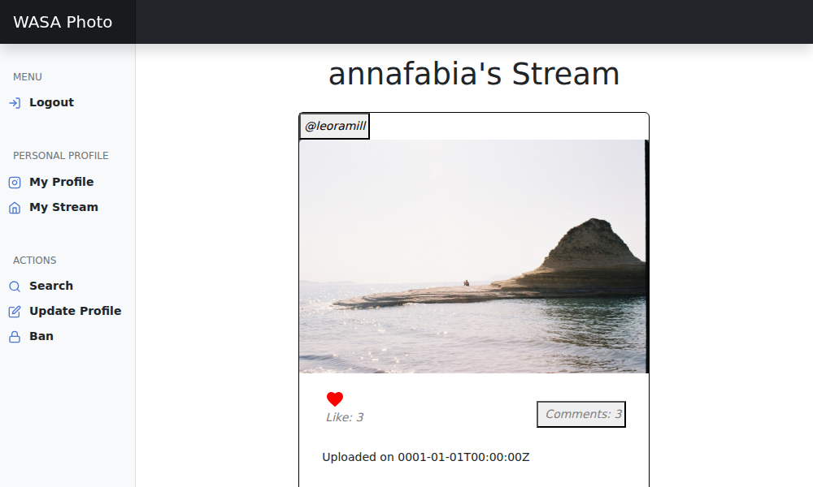
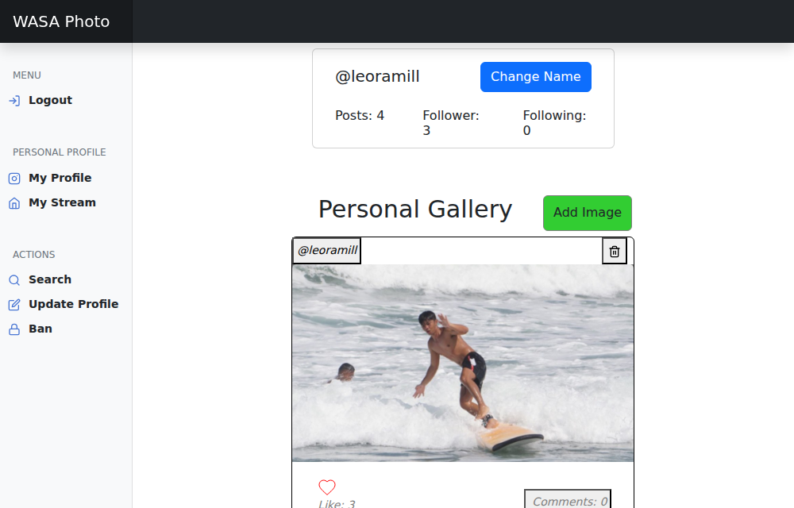

**Course** — Web and Software Architecture, Sapienza University of Rome · 2023/2024

**Stack** — Go · SQLite · OpenAPI 3 · Vue 3 · Bootstrap · Docker

**Code** — [github.com/LeoRamill/WASAPhoto](https://github.com/LeoRamill/WASAPhoto)

## Abstract

A photo-sharing social network specified in one sentence and delivered as a running system. The work
starts from the resources rather than from the code: the whole surface is written first as an
OpenAPI 3 contract — seventeen operations covering sessions, profiles, photographs, the stream,
likes, comments, following and banning — and the implementation is then held to it. The backend is
Go, layered so that a package of HTTP handlers, one per concern, sits over a data layer of one file
per table and lets no SQL escape it; persistence is SQLite with six tables whose foreign keys cascade
on delete, so removing a photograph removes its likes and its comments with it. Authentication is a
bearer identifier resolved on every request and checked against the user the URL names. The frontend
is a Vue 3 single-page application of small single-purpose components over that API, and the whole
thing ships as two multi-stage Docker images — a compiled binary on a bare Debian, and a static
build served by nginx — or, optionally, as one executable with the interface embedded in it. The
design decisions worth keeping are in the URL shapes: a like is an idempotent `PUT` on a resource
rather than a `POST` to an action, and a ban is a resource on the banning user's own profile, which
turns visibility rules into a join instead of a special case in every handler.

## The brief

> *Keep in touch with your friends by sharing photos of special moments. Directly from your PC, you
> can upload your photos, and they will be visible to everyone who is following you.*

That sentence is the whole specification. The exam gives you a social network in one paragraph and
an empty repository, and the work is everything between the two: deciding what the resources are,
writing the contract, implementing it, and putting a usable interface on top of it. It is the first
project I built as a system rather than as a program.

## The API comes first

The design starts in `doc/api.yaml`, not in the code. Before a line of Go exists, the whole surface
is written as an OpenAPI 3 document — every path, every request body, every response code, every
error — and the implementation is then held to it.

Seventeen operations, and the shape of the URLs is the design:

- `POST /session` — log in, or be created on first sight: that is the whole identity system.
- `GET /users/{id}/` and `GET /users/{id}/profile` — find a user, read a profile.
  `PUT /users/{id}/profile` changes your username.
- `GET /users/{id}/homepage` — your stream, the photos of everyone you follow.
- `POST`, `GET`, `DELETE` on `/users/{id}/profile/photos[/{photo}]` — upload, fetch, remove a photo.
- `PUT` and `DELETE` on `/users/{id}/homepage/{photo}/likes/{like}` — like and unlike.
- `POST` and `DELETE` on `/users/{id}/homepage/{photo}/comments[/{comment}]` — comment and uncomment.
- `PUT` and `DELETE` on `/users/{id}/profile/following/{other}` — follow and unfollow.
- `PUT`, `DELETE`, `GET` on `/users/{id}/profile/banned[/{other}]` — ban, unban, list bans.

A like is a `PUT` on a resource that either exists or does not, rather than a `POST` to an action —
which makes it idempotent, so a double tap cannot produce two likes. A ban is a resource on *your*
profile, not a flag on somebody else's, which is what makes "banned users cannot see me" a question
the database can answer with a join rather than a special case scattered through the handlers.

## The backend

Go, layered so that each layer only knows the one below it. `service/api` is one file per concern —
`api-photo.go`, `api-like.go`, `api-comment.go`, `api-follow.go`, `api-ban.go`, `api-session.go` —
and every handler starts by reading the `Authorization` header, resolving it to a user, and refusing
the request if that user is not the one the URL is about. `service/database` mirrors it with one
file per table and hands back plain structs, so no SQL escapes the data layer.

Six tables in SQLite, created on first boot: `users`, `photos`, `comments`, `likes`, `followers`,
`bans`. The relationships carry `ON DELETE CASCADE`, so deleting a photo takes its likes and its
comments with it and there is no orphan-cleanup code to forget to run. Photos are stored on disk
with a generated identifier; the row keeps the path, the poster and the timestamp.

## The frontend

A Vue 3 single-page application with Vue Router and Bootstrap: a sidebar for the permanent actions
(profile, stream, search, update, bans) and views for the rest. The interesting pieces are the small
components — `PhotoPost`, `Like`, `CommentWriter`, `PhotoComment`, `UserIdent`, `Follower` — because
each one owns its own call and its own piece of state, which keeps the views thin. `axios` is
configured once against the API base URL, and the session token travels with every request as the
`Authorization` header.

## Shipping it

Two Dockerfiles, both multi-stage. The backend builds in a `golang` image and the compiled binary is
copied into a bare `debian`, so the final image carries no toolchain; the frontend builds with npm
and is served by nginx. The two images run independently and talk over HTTP, which is the point of
the exercise: the backend has no idea a browser exists, and the frontend is just one of its clients.

There is also an embedded mode — `npm run build-embed` then `go build -tags webui` — which folds the
compiled frontend into the Go binary's filesystem and ships the whole application as one executable.

## What I took from it

Writing the contract before the code changes how you think. Every time I was tempted to add a
parameter or return a different shape, the question became *what does the specification say*, and
when the specification was wrong, it had to be fixed there first. That discipline is the reason the
frontend was straightforward to write: by then there was nothing left to invent, only to call.
