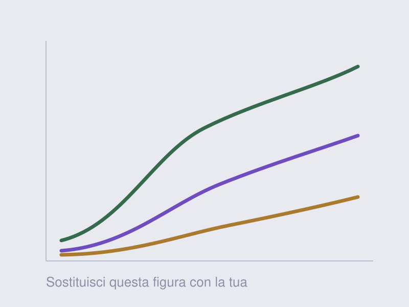

**Authors** — Leonard Vincent Ramil, ...

**Venue** — nome della conferenza o della rivista, anno.

Sostituisci questo testo con l'abstract o con il tuo riassunto del lavoro. Puoi usare paragrafi,
**grassetto**, *corsivo*, citazioni, formule e altre immagini, esattamente come in un articolo.

## Links

- [Paper](https://example.org)
- [Code](https://github.com/LeoRamill)
