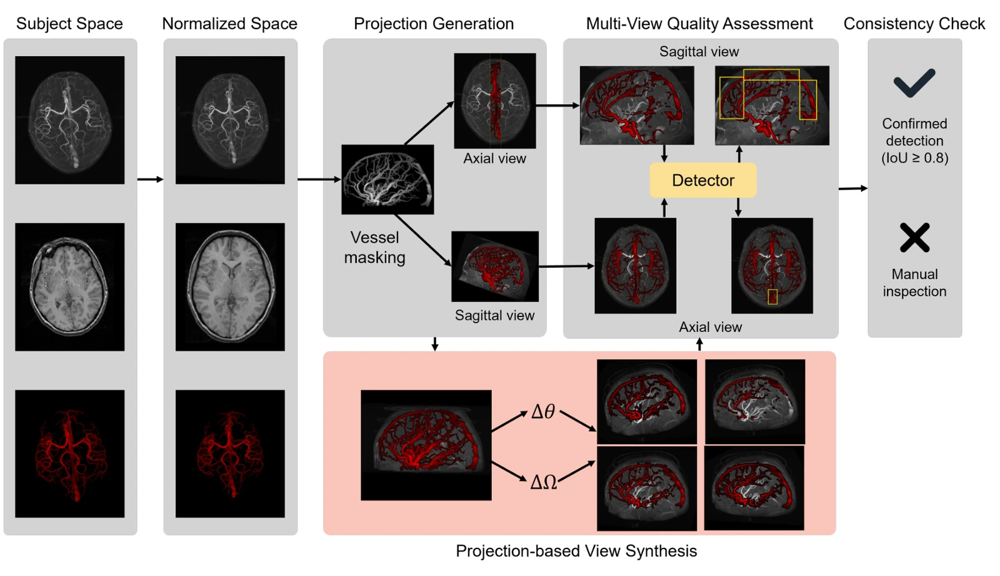

**Authors** — Bogdan Ion, Xiaoming Zhang, Leonard Vincent Ramil, Alice Boccadifuoco, Sébastien Ourselin, Jon Cleary, Maria A. Zuluaga

**Venue** — SWITCH+ 2026, MICCAI Workshop on Stroke and neurovascular diseases: Imaging and Treatment CHallenges. Strasbourg, France, September 2026.

**Affiliations** — EURECOM, Sophia Antipolis, France · Politecnico di Torino, Turin, Italy · School of Biomedical Engineering & Imaging Sciences, King's College London, UK

## Abstract

Reliable cerebrovascular analysis from 3D time-of-flight magnetic resonance angiography depends on the
anatomical completeness and consistency of vascular representations. However, automated vessel
segmentation may contain errors that hinder downstream analysis tasks. Identifying such errors directly
in 3D is challenging due to the complex topology of the cerebrovascular anatomy. In this work, we
propose a canonical multi-view framework for automated assessment of cerebrovascular segmentation
quality. Rather than reasoning directly over the complete 3D vascular tree, we reformulate localized
quality assessment as detection in canonical two-dimensional projection views, where anatomical
structures exhibit reproducible appearance. A lightweight detection model is applied independently to
complementary views, whose agreement is used to identify potentially erroneous segmentations for manual
inspection. To alleviate annotation scarcity, we propose view synthesis by perturbing projection angles
and slabs around anatomy-guided reference views, generating anatomically valid training examples from
the same registered 3D volume. We demonstrate the framework for identifying spurious superior sagittal
sinus segmentations in TOF-MRA and evaluate it on 99 subjects with manually annotated quality labels.
The proposed approach achieved an F1 score of 88.31, outperforming vision-language models (VLM)
operating in few-shot settings or adapted with LoRA, while relying on a lightweight task-specific
detector instead of large VLMs. Our results show that canonical projection views reformulate 3D
cerebrovascular quality assessment into a robust and efficient 2D detection problem, facilitating
scalable construction of reliable cerebrovascular analysis pipelines.

## Links

- [Paper (PDF)](https://hal.science/hal-05733902v1/file/MICCAI26_Workshop-8.pdf)
- [HAL record](https://hal.science/hal-05733902v1)
- [Google Scholar](https://scholar.google.com/citations?view_op=view_citation&hl=en&user=0SaJdxQAAAAJ&citation_for_view=0SaJdxQAAAAJ:WZBGuue-350C)
- [Code](https://github.com/erc-caravel/vascular-qc)
